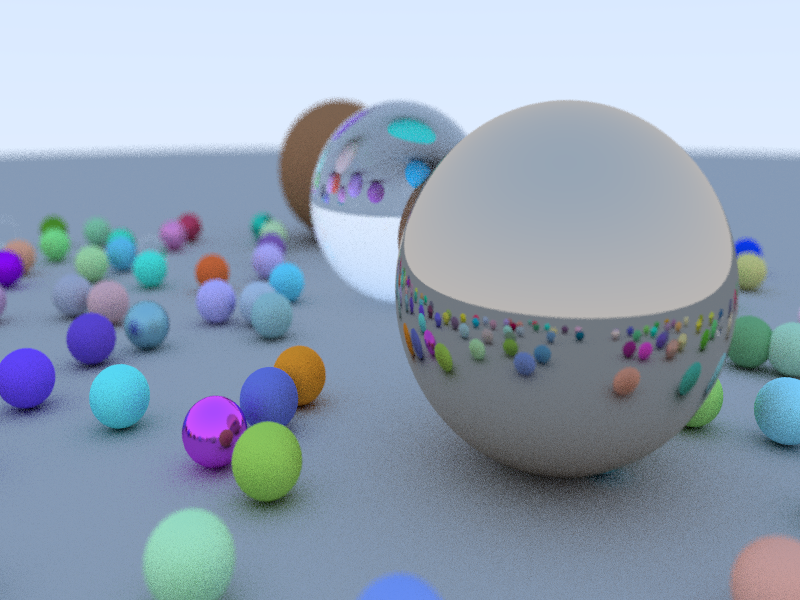

This is a small personal project to better understand raytracers. It's done by following the Peter Shirley's books "Raytracing in one weekend" and continuations.

## Basics

I'm using SDL to render the image to screen but will probably switch to OpenGL if eventually I want to add some fancy imGui stuff. Also, the project is build with an update pattern in case later I want to add some small animated rendering.

This project will probably advance slowly as I'm not full time invested in it.

## Current state

  

Right now, there is small optimizations apart from OpenMP for the main raycasting method. The next step will probably be some spatial optimization to try to gain some speed.

### Project information

Full project at github: [https://github.com/GuillemFP/SDLRayTracing](https://github.com/GuillemFP/SDLRayTracing)

Author: Guillem Ferré

Contact: guillemferre@gmail.com
