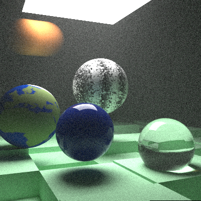

This is a small personal project to better understand raytracers. It's done by following the Peter Shirley's books "Raytracing in one weekend" and continuations.

## Basics

I'm using SDL to render the image to screen but will probably switch to OpenGL if eventually I want to add some fancy imGui stuff. Also, the project is build with an update pattern in case later I want to add some small animated rendering.

This project will probably advance slowly as I'm not full time invested in it.

## Current state

  

Recently I added image textures, motion blur, Perlin noise and volumes.

  

Optimization wise, the code is still running using OpenMP and has BVH setup. Next step will probably be moving everything to CUDA to gain some more speed.

### Project information

Full project at github: [https://github.com/GuillemFP/SDLRayTracing](https://github.com/GuillemFP/SDLRayTracing)

Author: Guillem Ferré

Contact: guillemferre@gmail.com
